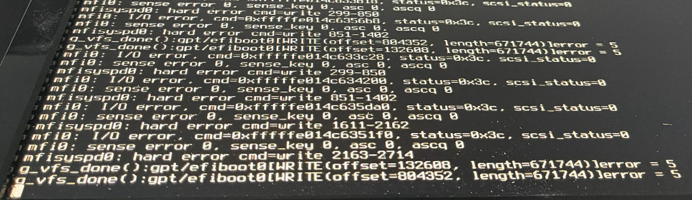
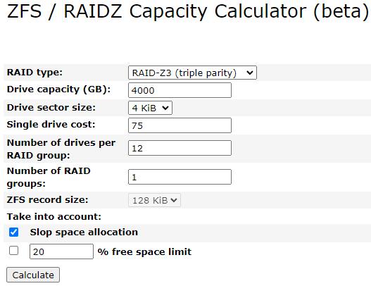
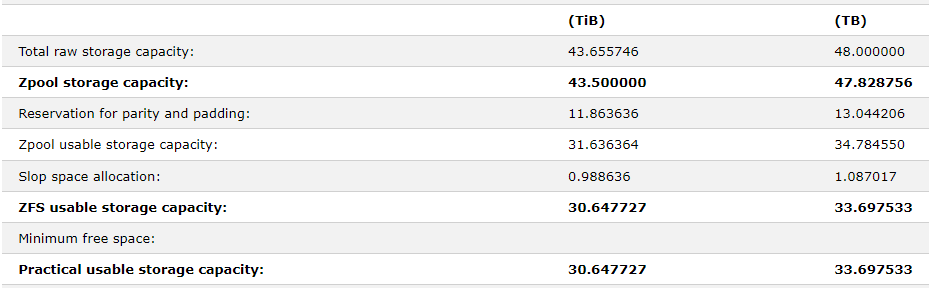

# Installing FreeBSD 14.1 Release  

## Issues  
[mfi driver](https://forums.freebsd.org/threads/using-mrsas-driver-during-10-3-install.56841/) causing I/O errors on install  
[BIOS settings](https://www.reddit.com/r/freebsd/comments/136o9xi/freebsd_on_dell_r730xd_woes/)  
RAID controller  

  

### BIOS fix 
1. Update all firmware through Life Cycle Controller  
2. X2APIC setting for the CPUs must be disabled  
    - this was already set correctly  

### RAID fix
set to HBA mode to pass through disks  
- Cleared RAID configuration  
- [Set to HBA mode](https://www.dell.com/support/manuals/en-us/poweredge-rc-h730/perc9ugpublication/switching-the-controller-to-hba-mode?guid=guid-1fcc87e1-d534-451a-9947-56f1175886c5&lang=en-us)  

### mfi driver fix  
on boot enter the loader prompt (option 3 for me)
- [FreeBSD Handbook Page](https://docs.freebsd.org/en/books/handbook/bsdinstall/#bsdinstall-view-probe)  

`set hw.mfi.mrsas_enable="1"`  
`autoboot`  
at the end of the install enter the shell and edit `/boot/loader.conf`  
add `hw.mfi.mrsas_enable="1"`  

## Install options
1. Install  
2. Continue with default keymap  
3. Set Hostname = NAS  
4. Distribution Select = kernel-dbg, lib32, ports  
5. Partitioning = Auto (ZFS)  
    - Pool Type/Disks = Mirror with the 2 x 128 GB drives  
    - Swap Size = 16g  
    - everything else as default  
6. Set the password  
7. Network Configuration = select the 1 port I had plugged in. I had a cable in port 1 on the hardware but it ended up being port bge2 instead of bge0. I found this by using DHCP setup which failed on the other ports.  
8. IPv6 = No  
9. Time Zone = UTC  
    - I chose this to not have to deal with Daylight Savings Time  
10. Time and Date = These were already correct for me  
11. System Configuration = sshd, ntpd_sync, dumpdev  
12. System Hardening = None  
13. Add Users = Yes  
    - added to the wheel group  
    - keep the remaining defaults and set password  
14. Apply configuration and exit  
15. Manual Configuration  
    - Yes to enter the shell  
    - `vi /boot/loader.conf`
    - add `hw.mfi.mrsas_enable="1"` to the end of the file  
    - exit back to menu  
16. Shutdown
    - Once shut down remove the USB installer and power on  

## Post install setup  

ssh to the server  
- `ssh user@192.168.1.24`  

### Install Software  
```bash
su - # become the root user
pkg # this sets up the package manager
pkg install vim, bash, git, zsh, tmux, sudo, freecolor, btop, iperf3, rsync
pkg prime-list # list user installed packages
pkg prime-orgins # list user installed packages source?

visudo # uncomment the line to allow %wheel to execute commands
chsh # change default shell to bash
mv .profile .profile.backup # My bashrc wouldn't load so I moved this and set a symbolic link which fixed it
ln -s .bashrc .profile
```
**set home/end key binding for putty**
```bash
cat
# press home key to get code
^[[1~
Ctrl + c
cat
# press end key to get code
^[[4~
Ctrl + c

vim ~/.zshrc
# add the following
bindkey "^[[4~" end-of-line
bindkey "^[[1~" beginning-of-line
# save file
source ~/.zshrc

vim ~/.bashrc
# add the following
bind '"\e[4~": end-of-line'
bind '"\e[1~": beginning-of-line'
# save file
source ~/.bashrc
```

## Disk Information  
Following Vermaden's enterprise [guide](https://vermaden.wordpress.com/2019/06/19/FreeBSD-enterprise-1-pb-storage/)  

Check what drives are installed on which device ID's  
```bash
sudo camcontrol devlist

<SEAGATE ST4000NM005A E002>        at scbus1 target 0 lun 0 (pass0,da0)
<SEAGATE ST4000NM005A E003>        at scbus1 target 1 lun 0 (pass1,da1)
<SEAGATE ST4000NM0005 MS06>        at scbus1 target 2 lun 0 (pass2,da2)
<SEAGATE ST4000NM0005 MS06>        at scbus1 target 3 lun 0 (pass3,da3)
<SEAGATE ST4000NM0005 MS06>        at scbus1 target 4 lun 0 (pass4,da4)
<SEAGATE ST4000NM0005 MS06>        at scbus1 target 5 lun 0 (pass5,da5)
<SEAGATE ST4000NM0025 N0C2>        at scbus1 target 6 lun 0 (pass6,da6)
<SEAGATE ST4000NM0025 N0C2>        at scbus1 target 7 lun 0 (pass7,da7)
<HITACHI HUS72604CLAR4000 N9C0>    at scbus1 target 8 lun 0 (pass8,da8)
<HITACHI HUS72604CLAR4000 N9C0>    at scbus1 target 9 lun 0 (pass9,da9)
<SEAGATE ST4000NM0025 CN04>        at scbus1 target 10 lun 0 (pass10,da10)
<SEAGATE ST4000NM017A CSJA>        at scbus1 target 11 lun 0 (pass11,da11)
<ATA SPCC Solid State 18C1>        at scbus1 target 12 lun 0 (pass12,da12) # mirror OS disk
<ATA SPCC Solid State 18B9>        at scbus1 target 13 lun 0 (pass13,da13) # mirror OS disk
<DP BP13G+EXP 3.35>                at scbus1 target 32 lun 0 (ses0,pass14) # not a disk
<AHCI SGPIO Enclosure 2.00 0001>   at scbus4 target 0 lun 0 (ses1,pass15) # not a disk
<AHCI SGPIO Enclosure 2.00 0001>   at scbus7 target 0 lun 0 (ses2,pass16) # not a disk
```

Current zpools  
```bash
zpool list

NAME    SIZE  ALLOC   FREE  CKPOINT  EXPANDSZ   FRAG    CAP  DEDUP    HEALTH  ALTROOT
zroot   102G  2.11G  99.9G        -         -     0%     2%  1.00x    ONLINE  -
```

Status of zpools  
```bash
zpool status

  pool: zroot
 state: ONLINE
config:

        NAME        STATE     READ WRITE CKSUM
        zroot       ONLINE       0     0     0
          mirror-0  ONLINE       0     0     0
            da12p4  ONLINE       0     0     0
            da13p4  ONLINE       0     0     0

errors: No known data errors
```

Current mount points  
```bash
df -h

Filesystem            Size    Used   Avail Capacity  Mounted on
zroot/ROOT/default     98G    1.3G     97G     1%    /
devfs                 1.0K      0B    1.0K     0%    /dev
/dev/gpt/efiboot0     260M    1.4M    259M     1%    /boot/efi
zroot/tmp              97G    104K     97G     0%    /tmp
zroot/var/tmp          97G     96K     97G     0%    /var/tmp
zroot/home             97G     96K     97G     0%    /home
zroot                  97G     96K     97G     0%    /zroot
zroot/usr/ports        98G    814M     97G     1%    /usr/ports
zroot/var/log          97G    164K     97G     0%    /var/log
zroot/var/audit        97G     96K     97G     0%    /var/audit
zroot/var/crash        97G     96K     97G     0%    /var/crash
zroot/usr/src          97G     96K     97G     0%    /usr/src
zroot/var/mail         97G    104K     97G     0%    /var/mail
zroot/home/mlitsey     97G    248K     97G     0%    /home/mlitsey
```

I'm choosing to go with raidZ3 because I have 12 used drives which came with the system. Even though these are enterprise drives, I will feel more at ease with the increased data protection. Using a [ZFS calculator](https://wintelguy.com/zfs-calc.pl) it shows that I will have approximately 30 TB of disk space.  

  

I won't be reformatting the drives as Vermaden did. I plan on adding larger drives to this setup in the future.  

## ZFS Pool Configuration  

I decided to set the ashift to 13 (8k) to help future proof the pool. Per the [Klara](https://klarasystems.com/articles/part-2-tuning-your-freebsd-configuration-for-your-nas/) write up. Setting the sectors higher shouldn't impact performance. 

```bash
sudo sysctl vfs.zfs.min_auto_ashift=13
```

Create the raidz3 pool  
```bash
echo da{0..11}p1 # to get the names to copy, lazy sysadmin...

da0p1 da1p1 da2p1 da3p1 da4p1 da5p1 da6p1 da7p1 da8p1 da9p1 da10p1 da11p1

sudo zpool create nas01 raidz3 da0p1 da1p1 da2p1 da3p1 da4p1 da5p1 da6p1 da7p1 da8p1 da9p1 da10p1 da11p1 # create the pool
```

Check the status of the pools  
```bash
zpool status

  pool: nas01
 state: ONLINE
config:

        NAME        STATE     READ WRITE CKSUM
        nas01       ONLINE       0     0     0
          raidz3-0  ONLINE       0     0     0
            da0p1   ONLINE       0     0     0
            da1p1   ONLINE       0     0     0
            da2p1   ONLINE       0     0     0
            da3p1   ONLINE       0     0     0
            da4p1   ONLINE       0     0     0
            da5p1   ONLINE       0     0     0
            da6p1   ONLINE       0     0     0
            da7p1   ONLINE       0     0     0
            da8p1   ONLINE       0     0     0
            da9p1   ONLINE       0     0     0
            da10p1  ONLINE       0     0     0
            da11p1  ONLINE       0     0     0

errors: No known data errors

  pool: zroot
 state: ONLINE
config:

        NAME        STATE     READ WRITE CKSUM
        zroot       ONLINE       0     0     0
          mirror-0  ONLINE       0     0     0
            da12p4  ONLINE       0     0     0
            da13p4  ONLINE       0     0     0

errors: No known data errors

zpool list

NAME    SIZE  ALLOC   FREE  CKPOINT  EXPANDSZ   FRAG    CAP  DEDUP    HEALTH  ALTROOT
nas01  43.7T  3.28M  43.7T        -         -     0%     0%  1.00x    ONLINE  -
zroot   102G  2.11G  99.9G        -         -     0%     2%  1.00x    ONLINE  -

zfs list

NAME                 USED  AVAIL  REFER  MOUNTPOINT
nas01               2.19M  29.0T   512K  /nas01         # new nas01 pool
zroot               2.11G  96.7G    96K  /zroot
zroot/ROOT          1.31G  96.7G    96K  none
zroot/ROOT/default  1.31G  96.7G  1.31G  /
zroot/home           352K  96.7G    96K  /home
zroot/home/mlitsey   256K  96.7G   256K  /home/mlitsey
zroot/tmp            104K  96.7G   104K  /tmp
zroot/usr            814M  96.7G    96K  /usr
zroot/usr/ports      814M  96.7G   814M  /usr/ports
zroot/usr/src         96K  96.7G    96K  /usr/src
zroot/var            652K  96.7G    96K  /var
zroot/var/audit       96K  96.7G    96K  /var/audit
zroot/var/crash       96K  96.7G    96K  /var/crash
zroot/var/log        164K  96.7G   164K  /var/log
zroot/var/mail       104K  96.7G   104K  /var/mail
zroot/var/tmp         96K  96.7G    96K  /var/tmp
```

## ZFS Settings  
```bash
sudo zfs set compression=lz4         nas01
sudo zfs set atime=off               nas01
#zfs set mountpoint=none         nas01 # I want to keep nas01 mounted
sudo zfs set recordsize=1m           nas01
sudo zfs set redundant_metadata=most nas01
sudo zfs create                      nas01/photos # I will setup snapshots for extra security on photos and documents
sudo zfs create                      nas01/documents
```

As this system has 192 GB RAM I'm following Vermaden and letting ZFS use 64-96GB of that amount for ARC, leaving the rest for bhyve or jails.  
```bash
vim /boot/loader.conf
vfs.zfs.prefetch_disable=1
vfs.zfs.cache_flush_disable=1
vfs.zfs.vdev.cache.size=16M
vfs.zfs.arc_min=64G
vfs.zfs.arc_max=96G
vfs.zfs.deadman_enabled=0
```

## System Settings

Here are the settings files output to compare with what is seen on the 1PB system. 

```bash
##### cat /etc/rc.conf
hostname="FBSD-NAS"
ifconfig_bge2="DHCP"
sshd_enable="YES"
ntpd_sync_on_start="YES"
moused_nondefault_enable="NO"
# Set dumpdev to "AUTO" to enable crash dumps, "NO" to disable
dumpdev="AUTO"
zfs_enable="YES"

##### cat /boot/loader.conf
kern.geom.label.disk_ident.enable="0"
kern.geom.label.gptid.enable="0"
cryptodev_load="YES"
zfs_load="YES"
hw.mfi.mrsas_enable="1"

# zfs settings
vfs.zfs.prefetch_disable=1
vfs.zfs.cache_flush_disable=1
vfs.zfs.vdev.cache.size=16M
vfs.zfs.arc_min=64G
vfs.zfs.arc_max=96G
vfs.zfs.deadman_enabled=0

##### cat /etc/sysctl.conf
#
#  This file is read when going to multi-user and its contents piped thru
#  ``sysctl'' to adjust kernel values.  ``man 5 sysctl.conf'' for details.
#

# Uncomment this to prevent users from seeing information about processes that
# are being run under another UID.
#security.bsd.see_other_uids=0
vfs.zfs.min_auto_ashift=12
```