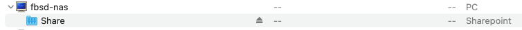
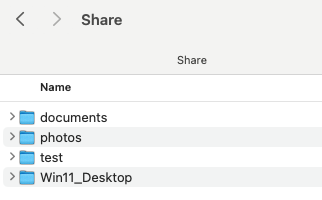
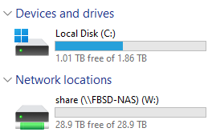
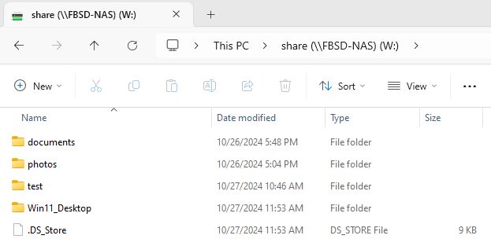

# Setting up file sharing  

I will be sharing this NAS between Windows, Linux, BSD, and Mac devices. So I'm choosing to use SMB and NFS for the initial setup.  

From the multiple write up on setting up SMB, I liked [this one](https://www.dokispace.com/posts/freebsd-file-server/) the most.  

## Set ZFS attributes
Get the current settings  
```bash
 ##### zfs get all nas01
NAME   PROPERTY              VALUE                  SOURCE
nas01  type                  filesystem             -
nas01  creation              Sat Oct 26 20:48 2024  -
nas01  used                  6.16M                  -
nas01  available             29.0T                  -
nas01  referenced            554K                   -
nas01  compressratio         1.00x                  -
nas01  mounted               yes                    -
nas01  quota                 none                   default
nas01  reservation           none                   default
nas01  recordsize            1M                     local
nas01  mountpoint            /nas01                 default
nas01  sharenfs              off                    default
nas01  checksum              on                     default
nas01  compression           lz4                    local
nas01  atime                 off                    local
nas01  devices               on                     default
nas01  exec                  on                     default
nas01  setuid                on                     default
nas01  readonly              off                    default
nas01  jailed                off                    default
nas01  snapdir               hidden                 default
nas01  aclmode               discard                default
nas01  aclinherit            restricted             default
nas01  createtxg             1                      -
nas01  canmount              on                     default
nas01  xattr                 on                     default
nas01  copies                1                      default
nas01  version               5                      -
nas01  utf8only              off                    -
nas01  normalization         none                   -
nas01  casesensitivity       sensitive              -
nas01  vscan                 off                    default
nas01  nbmand                off                    default
nas01  sharesmb              off                    default
nas01  refquota              none                   default
nas01  refreservation        none                   default
nas01  guid                  14776690124490289015   -
nas01  primarycache          all                    default
nas01  secondarycache        all                    default
nas01  usedbysnapshots       0B                     -
nas01  usedbydataset         554K                   -
nas01  usedbychildren        5.62M                  -
nas01  usedbyrefreservation  0B                     -
nas01  logbias               latency                default
nas01  objsetid              54                     -
nas01  dedup                 off                    default
nas01  mlslabel              none                   default
nas01  sync                  standard               default
nas01  dnodesize             legacy                 default
nas01  refcompressratio      1.00x                  -
nas01  written               554K                   -
nas01  logicalused           778K                   -
nas01  logicalreferenced     86.5K                  -
nas01  volmode               default                default
nas01  filesystem_limit      none                   default
nas01  snapshot_limit        none                   default
nas01  filesystem_count      none                   default
nas01  snapshot_count        none                   default
nas01  snapdev               hidden                 default
nas01  acltype               nfsv4                  default
nas01  context               none                   default
nas01  fscontext             none                   default
nas01  defcontext            none                   default
nas01  rootcontext           none                   default
nas01  relatime              on                     default
nas01  redundant_metadata    most                   local
nas01  overlay               on                     default
nas01  encryption            off                    default
nas01  keylocation           none                   default
nas01  keyformat             none                   default
nas01  pbkdf2iters           0                      default
nas01  special_small_blocks  0                      default
nas01  prefetch              all                    default

##### zfs get all nas01/photos
NAME          PROPERTY              VALUE                  SOURCE
nas01/photos  type                  filesystem             -
nas01/photos  creation              Sat Oct 26 21:04 2024  -
nas01/photos  used                  512K                   -
nas01/photos  available             29.0T                  -
nas01/photos  referenced            512K                   -
nas01/photos  compressratio         1.00x                  -
nas01/photos  mounted               yes                    -
nas01/photos  quota                 none                   default
nas01/photos  reservation           none                   default
nas01/photos  recordsize            1M                     inherited from nas01
nas01/photos  mountpoint            /nas01/photos          default
nas01/photos  sharenfs              off                    default
nas01/photos  checksum              on                     default
nas01/photos  compression           lz4                    inherited from nas01
nas01/photos  atime                 off                    inherited from nas01
nas01/photos  devices               on                     default
nas01/photos  exec                  on                     default
nas01/photos  setuid                on                     default
nas01/photos  readonly              off                    default
nas01/photos  jailed                off                    default
nas01/photos  snapdir               hidden                 default
nas01/photos  aclmode               discard                default
nas01/photos  aclinherit            restricted             default
nas01/photos  createtxg             207                    -
nas01/photos  canmount              on                     default
nas01/photos  xattr                 on                     default
nas01/photos  copies                1                      default
nas01/photos  version               5                      -
nas01/photos  utf8only              off                    -
nas01/photos  normalization         none                   -
nas01/photos  casesensitivity       sensitive              -
nas01/photos  vscan                 off                    default
nas01/photos  nbmand                off                    default
nas01/photos  sharesmb              off                    default
nas01/photos  refquota              none                   default
nas01/photos  refreservation        none                   default
nas01/photos  guid                  7474652455169899277    -
nas01/photos  primarycache          all                    default
nas01/photos  secondarycache        all                    default
nas01/photos  usedbysnapshots       0B                     -
nas01/photos  usedbydataset         512K                   -
nas01/photos  usedbychildren        0B                     -
nas01/photos  usedbyrefreservation  0B                     -
nas01/photos  logbias               latency                default
nas01/photos  objsetid              1283                   -
nas01/photos  dedup                 off                    default
nas01/photos  mlslabel              none                   default
nas01/photos  sync                  standard               default
nas01/photos  dnodesize             legacy                 default
nas01/photos  refcompressratio      1.00x                  -
nas01/photos  written               512K                   -
nas01/photos  logicalused           78.5K                  -
nas01/photos  logicalreferenced     78.5K                  -
nas01/photos  volmode               default                default
nas01/photos  filesystem_limit      none                   default
nas01/photos  snapshot_limit        none                   default
nas01/photos  filesystem_count      none                   default
nas01/photos  snapshot_count        none                   default
nas01/photos  snapdev               hidden                 default
nas01/photos  acltype               nfsv4                  default
nas01/photos  context               none                   default
nas01/photos  fscontext             none                   default
nas01/photos  defcontext            none                   default
nas01/photos  rootcontext           none                   default
nas01/photos  relatime              on                     default
nas01/photos  redundant_metadata    most                   inherited from nas01
nas01/photos  overlay               on                     default
nas01/photos  encryption            off                    default
nas01/photos  keylocation           none                   default
nas01/photos  keyformat             none                   default
nas01/photos  pbkdf2iters           0                      default
nas01/photos  special_small_blocks  0                      default
nas01/photos  prefetch              all                    default

##### zfs get all nas01/documents
NAME             PROPERTY              VALUE                  SOURCE
nas01/documents  type                  filesystem             -
nas01/documents  creation              Sat Oct 26 21:04 2024  -
nas01/documents  used                  512K                   -
nas01/documents  available             29.0T                  -
nas01/documents  referenced            512K                   -
nas01/documents  compressratio         1.00x                  -
nas01/documents  mounted               yes                    -
nas01/documents  quota                 none                   default
nas01/documents  reservation           none                   default
nas01/documents  recordsize            1M                     inherited from nas01
nas01/documents  mountpoint            /nas01/documents       default
nas01/documents  sharenfs              off                    default
nas01/documents  checksum              on                     default
nas01/documents  compression           lz4                    inherited from nas01
nas01/documents  atime                 off                    inherited from nas01
nas01/documents  devices               on                     default
nas01/documents  exec                  on                     default
nas01/documents  setuid                on                     default
nas01/documents  readonly              off                    default
nas01/documents  jailed                off                    default
nas01/documents  snapdir               hidden                 default
nas01/documents  aclmode               discard                default
nas01/documents  aclinherit            restricted             default
nas01/documents  createtxg             209                    -
nas01/documents  canmount              on                     default
nas01/documents  xattr                 on                     default
nas01/documents  copies                1                      default
nas01/documents  version               5                      -
nas01/documents  utf8only              off                    -
nas01/documents  normalization         none                   -
nas01/documents  casesensitivity       sensitive              -
nas01/documents  vscan                 off                    default
nas01/documents  nbmand                off                    default
nas01/documents  sharesmb              off                    default
nas01/documents  refquota              none                   default
nas01/documents  refreservation        none                   default
nas01/documents  guid                  8403601402215526272    -
nas01/documents  primarycache          all                    default
nas01/documents  secondarycache        all                    default
nas01/documents  usedbysnapshots       0B                     -
nas01/documents  usedbydataset         512K                   -
nas01/documents  usedbychildren        0B                     -
nas01/documents  usedbyrefreservation  0B                     -
nas01/documents  logbias               latency                default
nas01/documents  objsetid              147                    -
nas01/documents  dedup                 off                    default
nas01/documents  mlslabel              none                   default
nas01/documents  sync                  standard               default
nas01/documents  dnodesize             legacy                 default
nas01/documents  refcompressratio      1.00x                  -
nas01/documents  written               512K                   -
nas01/documents  logicalused           78.5K                  -
nas01/documents  logicalreferenced     78.5K                  -
nas01/documents  volmode               default                default
nas01/documents  filesystem_limit      none                   default
nas01/documents  snapshot_limit        none                   default
nas01/documents  filesystem_count      none                   default
nas01/documents  snapshot_count        none                   default
nas01/documents  snapdev               hidden                 default
nas01/documents  acltype               nfsv4                  default
nas01/documents  context               none                   default
nas01/documents  fscontext             none                   default
nas01/documents  defcontext            none                   default
nas01/documents  rootcontext           none                   default
nas01/documents  relatime              on                     default
nas01/documents  redundant_metadata    most                   inherited from nas01
nas01/documents  overlay               on                     default
nas01/documents  encryption            off                    default
nas01/documents  keylocation           none                   default
nas01/documents  keyformat             none                   default
nas01/documents  pbkdf2iters           0                      default
nas01/documents  special_small_blocks  0                      default
nas01/documents  prefetch              all                    default
```
Set new options  
I'm not sure if the settings would pass down to photos and documents, so I'm setting them. 
```bash
zfs set xattr=sa dnodesize=auto relatime=on aclmode=restricted aclinherit=passthrough nas01
zfs set xattr=sa dnodesize=auto relatime=on aclmode=restricted aclinherit=passthrough nas01/photos
zfs set xattr=sa dnodesize=auto relatime=on aclmode=restricted aclinherit=passthrough nas01/documents
```

## Install SAMBA  
```bash
##### pkg search samba
p5-Samba-LDAP-0.05_2           Manage a Samba PDC with an LDAP Backend
p5-Samba-SIDhelper-0.0.0_3     Create SIDs based on G/UIDs
samba-nsupdate-9.16.5_1        nsupdate utility with the GSS-TSIG support
samba416-4.16.11_5             Free SMB/CIFS and AD/DC server and client for Unix
samba419-4.19.8_1              Free SMB/CIFS and AD/DC server and client for Unix

pkg install samba419
```

SAMBA configuration file   
```bash
vim /usr/local/etc/smb4.conf
[global]
   vfs objects = zfsacl fruit streams_xattr

   fruit:metadata = stream
   fruit:copyfile = yes
   fruit:veto_appledouble = no
   fruit:model = MacPro7,1@ECOLOR=226,226,224
   fruit:model = MacSamba

   nfs4:chown = true
   disable netbios = yes
   strict sync = no
   use sendfile = yes
   block size = 8192
   fstype = ZFS

   server smb encrypt = required

[Share]
   path = /nas01/
   read only = no
```

Create users and groups  
```bash
# create users
adduser

# create groups
pw group add -n $group_name
pw group add -n nas

# add user to group
pw groupmod $group_name -m $user_name
pw groupmod nas -m mlitsey

# verify user is in the group
grep $user_name /etc/group
grep mlitsey /etc/group
    wheel:*:0:root,mlitsey
    mlitsey:*:1001:
    nas:*:1002:mlitsey

# add user to SAMBA
pdbedit -a -u $user_name
pdbedit -a -u mlitsey
```

Setting Permissions and ACLs  
```bash
# remove any existing NFSv4 ACLs
setfacl -b -R /nas01

# change ownership of the directories
chown -R $user_name:$group_name /nas01
chown -R mlitsey:nas /nas01

# change permissions of the directories to allow owner and group full permissions. All others are blocked
chmod -R 770 /nas01

# set NFSv4 ACLs
setfacl -R -m owner@:full_set:fd:allow,group@:modify_set:fd:allow,everyone@::fd:allow /nas01 # should everyone be removed?
```
[setfacl man page](https://man.freebsd.org/cgi/man.cgi?setfacl)  
- "owner@" specifying the access granted to the owner of the file  
- "group@" specifying the access granted to the file owning group  
- "everyone@" specifying everyone. Note that "everyone@" is not the same as traditional Unix "other" - it means, literally, everyone, including file owner and owning group.  
- full_set = all permissions  
- modify_set = all permissions except write_acl and	write_owner  
- fd = file_inherit, dir_inherit  
- allow = ACL type field is either "allow" or "deny"  


Start SAMBA service
```bash
# allow samba service to start on boot
service samba_server enable
    samba_server enabled in /etc/rc.conf

# start service now
service samba_server start
    Performing sanity check on Samba configuration: OK
    Starting nmbd.
    Starting smbd.
```

## Test SMB
From windows explorer navigate to the SAMBA share.  
`\\$ip_address\$share_name`  
`\\192.168.1.24\nas01`  

At this point my password didn't work  
Need to set a smb password per [this article](https://www.cyberciti.biz/faq/adding-a-user-to-a-samba-smb-share/)  
```bash
smbpasswd -a $user_name
smbpasswd -a mlitsey
```

The password worked this time. Received another error  
"Windows can not access share"  

Tested from Mac-mini and was able to connect.  

Tried again on windows 11 with `.\$username`  

Found an [article](https://learn.microsoft.com/en-us/answers/questions/957194/windows-11-smb-client-cannot-connect-to-smb-share) stating to install SMB client v1.  

After installing SMB client and restarting the pc I was still unable to connect. I thought that it could be something with DNS ,because the server wouldn't show up under netowrk, but could not find a fix.  

I tried a couple of Windows tools and those came back good, but didn't show the shares. 
```ps1
# 1st test command
Test-NetConnection -ComputerName FBSD-NAS -CommonTCPPort SMB                                                                                                                                                                                                                                                         ComputerName     : FBSD-NAS
RemoteAddress    : 192.168.1.24
RemotePort       : 445
InterfaceAlias   : Wi-Fi
SourceAddress    : 192.168.1.251
TcpTestSucceeded : True

# 2nd test command
net view \\FBSD-NAS\
Shared resources at \\FBSD-NAS\

Samba 4.19.8

Share name  Type  Used as  Comment

-------------------------------------------------------------------------------
Share       Disk
The command completed successfully.
```

I went back to the mac-mini and noticed that when it mounted the share it showed up as `\\FBSD-NAS\share`. I switched back to the pc and tried using that path.   

  
  

It connected immediately, and I was able to add files and folders.  

  

  

