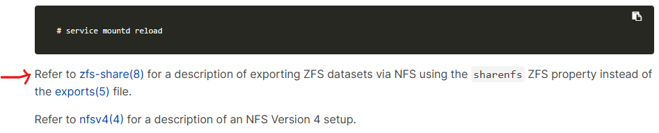
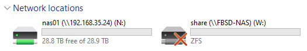
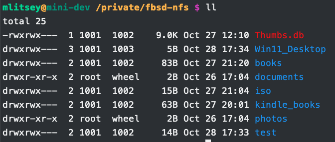

# Setting up NFS File Sharing  

> 💡 **Update:**  
> I turned SMB back on due to transfer speeds with Windows  
> With NFS, tranfers were in the KBps but with SMB it was in the MBps  
> `service samba_server onestart`  

I started with the [FreeBSD Handbook](https://docs.freebsd.org/en/books/handbook/network-servers/#network-nfs), but also watched GaryH Tech [video1](https://m.youtube.com/watch?v=sobs3VU7ihw) and [video2](https://youtu.be/1fCasS0WZlo?si=42t8ePerOEHpd9C1) on YouTube.  

I didn't know that I could get NFS working on Windows until the GaryH Tech video. I looked around and found these [video](https://www.youtube.com/watch?app=desktop&v=A9aRO_rHdpM) [video2](https://youtu.be/mOoO9mFE7BI?si=oKePVL_zcL4P2z_M) by Titus Tech Talk for setting it up.  

And a write up [here](https://blog.netwrix.com/2022/11/18/mounting-nfs-client-windows/)  

Guess I should remove SMB for security reasons.....  

On to the setup  

```bash
# sudo vim /etc/rc.conf or /etc/rc.conf.local
# I added the blow lines to the end of the file

### NFS Server Setup
nfs_server_enable="YES"
nfs_server_flags="-u -t -n 10"
rpcbind_enable="YES"
mountd_enable="YES"
mountd_flags="-r"
```
[nfsd](https://man.freebsd.org/cgi/man.cgi?nfsd) settings  
- u = Serve UDP NFS clients.  
- t = Serve TCP NFS clients.  
- n = Specifies  how  many servers/threads to create.  

[mountd](https://man.freebsd.org/cgi/man.cgi?mountd(8)) settings  
- r = Allow mount RPCs	requests for regular files to be served.  

setup the exports file  
```bash
# vim /etc/exports
/nas01 -maproot=mlitsey -network 192.168.35.0/24 # this lets all addresses with in 192.168.35 to connect
```
[exports](https://man.freebsd.org/cgi/man.cgi?query=exports&sektion=5&format=html) settings  
- directory to share  
- maproot = The credential of the specified user is used for remote access by root.  
- ip range to share with  

start the services without rebooting  
```
rpcbind
nfsd -u -t -n 10
mountd -r
```

I then tested the connection and received an error.  

```ps1
mount \\FBSD-NAS\nas01 N:
Network Error - 53

Type 'NET HELPMSG 53' for more information.
```

Then on mac-mini  
```bash
showmount -e 192.168.35.24
showmount: Cannot retrieve info from host: 192.168.35.24: RPC: Program not registered
```

I then noticed the line right after `service mountd reload` in the handbook that says to check [zfs-share(8)](https://man.freebsd.org/cgi/man.cgi?query=zfs-share&sektion=8&format=html) for ZFS instead of exports(5)  

  

I also found this [wiki](https://wiki.freebsd.org/ZFS/ShareNFS)  

New `/etc/rc.conf` configuration.  
```bash
### NFS Server Setup
nfs_server_enable="YES"
nfs_server_flags="-u -t -n 10"
rpcbind_enable="YES"
mountd_enable="YES"
mountd_flags="-r"
rpc_lockd_enable="YES"
rpc_statd_enable="YES"
```

Turn on sharenfs for the ZFS pool  
```bash
# zfs get sharenfs nas01
NAME   PROPERTY  VALUE     SOURCE
nas01  sharenfs  off       default

# zfs get sharenfs nas01/photos
NAME          PROPERTY  VALUE     SOURCE
nas01/photos  sharenfs  off       default

# zfs get sharenfs nas01/documents
NAME             PROPERTY  VALUE     SOURCE
nas01/documents  sharenfs  off       default

zfs set sharenfs='-mapall=mlitsey,-network=192.168.35.0/24' nas01

# zfs get sharenfs nas01
NAME   PROPERTY  VALUE                                     SOURCE
nas01  sharenfs  -mapall=mlitsey,-network=192.168.35.0/24  local


# zfs get sharenfs nas01/photos
NAME          PROPERTY  VALUE                                     SOURCE
nas01/photos  sharenfs  -mapall=mlitsey,-network=192.168.35.0/24  inherited from nas01


# zfs get sharenfs nas01/documents
NAME             PROPERTY  VALUE                                     SOURCE
nas01/documents  sharenfs  -mapall=mlitsey,-network=192.168.35.0/24  inherited from nas01

service rpcbind restart
service nfsd restart
service mountd restart
```

I was then able to get NFS share on Windows 11 box. Which also disconnected the SMB share.  
```ps1
mount -o anon \\192.168.35.24\nas01 n:
n: is now successfully connected to \\192.168.35.24\nas01

The command completed successfully.
```
  

I still had a problem with the mac-mini though.  

```bash
sudo mount -t nfs 192.168.35.24:/nas01 /private/fbsd-nfs
mount_nfs: can't mount with remote locks when server (192.168.35.24) is not running rpc.statd: RPC prog. not avail
mount: /private/fbsd-nfs failed with 74
```

Again further down in the handbook, I found a section about [locks](https://docs.freebsd.org/en/books/handbook/network-servers/#_locking).  
```bash
sysrc rpc_lockd_enable="YES"
rpc_lockd_enable: YES -> YES

service lockd start
Starting statd.
Starting lockd.
```

I tried mounting the NFS share again, with success.  
```bash
sudo mount_nfs 192.168.35.24:/nas01 /private/fbsd-nfs
```

  

Mounting share to my Ubuntu NUC box  
```bash
apt update
apt install nfs-common
mount -t nfs 192.168.35.24:/nas01 /mnt/nas01
ll /mnt/nas01/

vim /etc/fstab
# add line to bottom of file
192.168.35.24:/nas01 /mnt/nas01 nfs defaults 0 0

umount /mnt/nas01
systemctl daemon-reload
mount -a
ll /mnt/nas01/
```


I stopped the SAMBA service and disabled it.  
```bash
# service samba_server stop
Stopping smbd.
Waiting for PIDS: 1449.
Stopping nmbd.
Waiting for PIDS: 1445.

vim /etc/rc.conf
# put # infront of line to disable
#samba_server_enable="YES"
```


