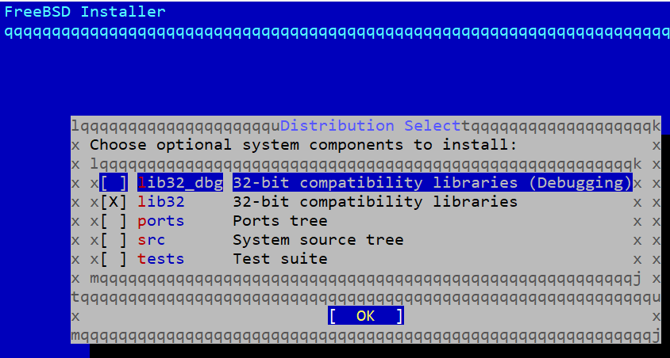
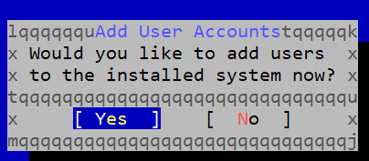
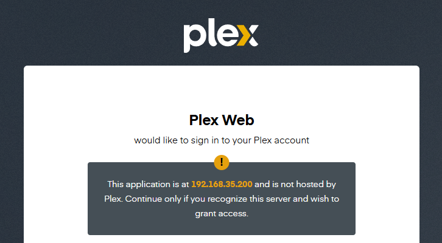
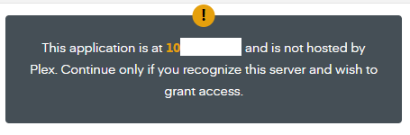

# Setting up Plex container  

I started out using [this](https://www.willhaley.com/blog/plex-jail-freebsd/) write up but found that some items seem to have changed since it was written. Or because I'm using zfs instead of ufs.  
I went with a mix of the [Handbook](https://docs.freebsd.org/en/books/handbook/jails/) and the write up for setting up my plex jail  

## Install the jail  
```bash
# add jail service to /etc/rc.conf
sysrc jail_enable="YES"

# create mount points for jails
zfs create -o mountpoint=/usr/local/jails zroot/jails
zfs create zroot/jails/media
zfs create zroot/jails/templates
zfs create zroot/jails/containers
zfs create zroot/jails/plex

# create the plex jail in the mount point
bsdinstall jail /usr/local/jails/plex
```

Then you get a screen like this  


I accepted the defaults  
set the root password  
- example password = RootPassword  

setup the plex user using default settings  
  
- example password = PlexPassword  

and end up back at the command line  

## Setup the plex jail config file  
I had to set the interface in the config to be able to install pkg and plexmediaserver  
I also had to create the directories for the mount command  

```bash
vim /etc/jail.conf

plex {
    host.hostname = "plex";
    path = "/usr/local/jails/plex";

    exec.clean;
    allow.raw_sockets;

    # Use an open IP in the same range as the interface
    ip4.addr = 192.168.35.200;
    interface = bge2;

    exec.prestart += "mount -t nullfs -o ro,nofail /nas01/Movies /usr/local/jails/plex/movies";
    exec.prestart += "mount -t nullfs -o ro,nofail /nas01/Shows /usr/local/jails/plex/shows";
    exec.prestart += "mount -t nullfs -o ro,nofail /nas01/Media /usr/local/jails/plex/media";
    exec.poststop += "umount /usr/local/jails/plex/movies";
    exec.poststop += "umount /usr/local/jails/plex/shows";
    exec.poststop += "umount /usr/local/jails/plex/media";

    exec.start += "/bin/sh /etc/rc";
    exec.stop = "/bin/sh /etc/rc.shutdown jail";
    exec.consolelog = "/var/log/jail_plex_console.log";
    mount.devfs;
    devfs_ruleset = "11";
}

mkdir -p /usr/local/jails/plex/movies
mkdir -p /usr/local/jails/plex/shows
mkdir -p /usr/local/jails/plex/media
```

## Start and enter the plex jail  

```bash
# start the jail 
service jail start plex

# verify jail is running 
jls
   JID  IP Address      Hostname                      Path
     1  192.168.35.200  plex                         /usr/local/jails/plex

# go to jail command line
jexec $JID
jexec $Hostname
jexec plex 
jexec: execlp: /usr/local/bin/bash: No such file or directory

# bash isn't installed in the jail yet, start with sh instead 
jexec plex sh
```
My default shell is bash so when I entered the jail the prompt was messed up  
```bash
\033[01;32mroot\033[01;33m@\033[01;36mplex \033[01;33m/ \033[01;35m#

# set PS1 to be readable 
PS1='[\u@\h \W]\$ '
[root@plex /]#

# install bash shell in the jail
pkg install bash 
The package management tool is not yet installed on your system.
Do you want to fetch and install it now? [y/N]: y
Proceed with this action? [y/N]: y
exit # now bash is installed exit and restart in bash
jexec plex
pkg install plexmediaserver
sysrc plexmediaserver_enable="YES"
service plexmediaserver start
```

visit plex page  
`http://$Plex_jail_IP:32400/web`  



## Using tailscale for the IP  

I want to be able to access this remotely using my [tailscale vpn](./7_administrative_tasks.md). Should I created a second jail with an almost identical configuration? or just switch the IP when needed? 


```bash
vim /etc/jail.conf

    # Use an open IP in the same range as the interface
    #ip4.addr = 192.168.35.200;
    #interface = bge2;
    ip4 = inherit;
    interface = tailscale0;

```

visit plex page  
`http://$tailscale_IP:32400/web`  




